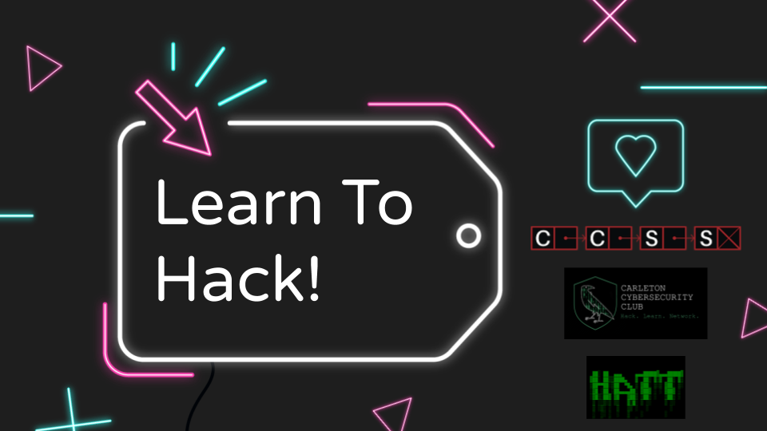
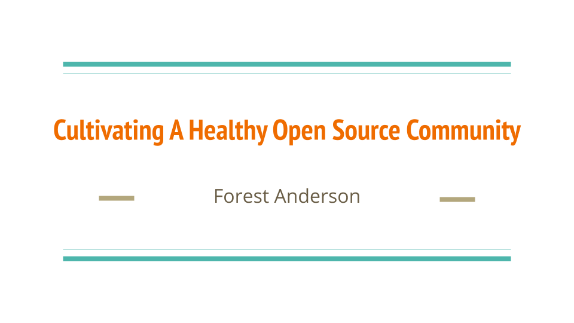

# Talks
A repo of talks I've given.

## Learn to Hack!

#### CCSS WoA Tech Talk

[Youtube](https://www.youtube.com/watch?v=GEOkrb5S7W0) |
[Slides](https://github.com/AngelOnFira/talks/blob/master/learn-to-hack.pdf)

## Cultivating A Healthy Open Source Community

#### CUSEC 2020

[Youtube](https://www.youtube.com/watch?v=aS26sqT09Pw) |
[Slides](https://github.com/AngelOnFira/talks/blob/master/cultivating-healthy-open-source.pdf)

